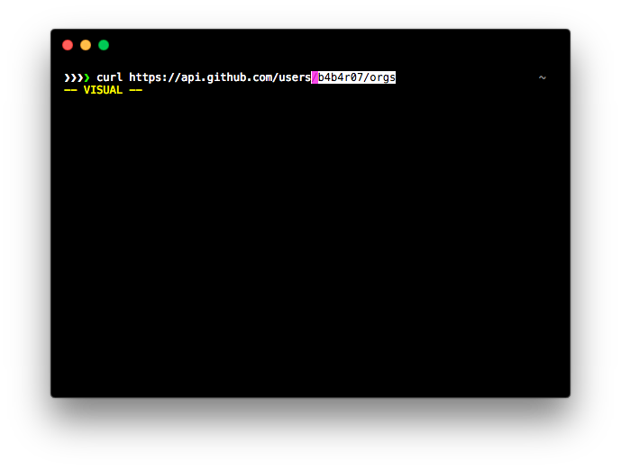

ultimate
========

`ultimate` is a zsh theme, the fork version [S1cK94/minimal](https://github.com/S1cK94/minimal).



## Features

- git prompt
- vim indicator
- short pwd like vim (`pathshorten()`)

## Installation

By using [zplug](https://github.com/zplug/zplug) you can easily install as a theme.

```zsh
zplug "b4b4r07/ultimate", as:theme
```

## TODOs

- [ ] async updating prompt (like [sindresorhus/pure](https://github.com/sindresorhus/pure))
- [ ] More cool
- [ ] Faster (using cache)

## License

MIT

## Author

b4b4r07